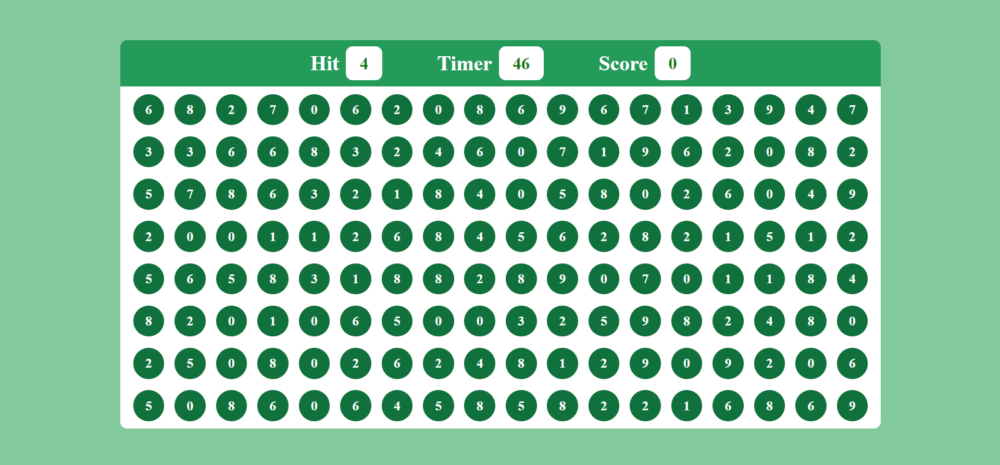
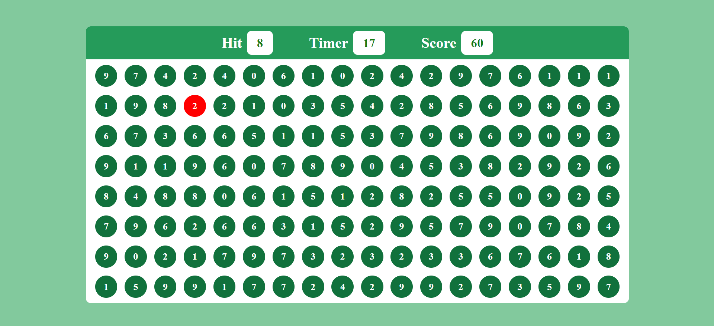

# Bubble Burst Bash

The Bubble Game is an engaging and addictive web-based gaming experience that combines quick reflexes with math skills. In this fast-paced game, players aim to hit as many bubbles as possible, each bearing a face value that matches the target value displayed at the top of the screen. The ultimate objective is to achieve a score of +10 or higher within a challenging 60-second time limit.


## Game Play

- Start the Game: Players access the Bubble Game by visiting its website and clicking the "Play" button.

- Bubble Frenzy: As the game begins, bubbles filled with random numbers start to float across the screen.

- Match the Target: The key to success is to hit bubbles whose face values match the target value prominently showcased at the top of the screen.

- Score Points: Successfully hitting a bubble with the correct face value awards players points. The game-winning target is set at +10.

- Race Against the Clock: Time is of the essence as players only have 60 seconds to reach or surpass the coveted +10 score. An easily visible timer keeps them informed.

- Victory or Defeat: Victory is achieved by reaching a score of +10 or higher before the timer expires. If the timer runs out first, players can choose to try their luck again.

## Installation

Clone the game repository from GitHub:
```bash
  git clone https://github.com/ayushanand10/bubbleBurstBash.git
```
Navigate to the project directory:
```bach
  cd bubble-game
```
Launch the game by opening the `index.html` file in your preferred web browser.
    
## Screenshots




## Technology Stack
The Bubble Game is crafted using a trio of fundamental web technologies:

- HTML5: HTML5 provides the structural framework for the game's interface.
- CSS3: CSS3 is used for styling and visual enhancements, making the game visually appealing.
- JavaScript: The game's logic and interactivity are powered by JavaScript.